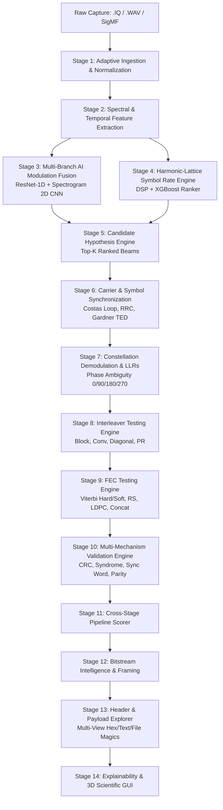

# ARCHITECTURE.md
## ASTRA — System Architecture & Multi-Stage Processing Pipeline

---

### 1. Architectural Philosophy

ASTRA (Automated Signal Analysis & Recovery Assistant) is designed as a **deterministic, hypothesis-driven, multi-stage intelligence pipeline** for unknown radio frequency signals. 

Rather than relying on fragile single-point decisions, ASTRA applies the **Candidate Beam Principle**:
```
Ingest → Extract Multi-Modal Evidence → Synthesize Top-K Hypotheses → Synchronize & Test → Decode → Cross-Stage Validation & Ranking → Explainable Reporting
```

Every candidate preserves its complete lineage from raw RF samples down to recovered application payload bits.

---

### 2. High-Level System Architecture



---

### 3. Detailed Stage Responsibilities & Data Contracts

#### Stage 1: Adaptive Ingestion & Preprocessing
- **Source:** `astra_synthetic/capture/`, `astra_gui/src/app/main_window.py`
- **Input:** File path (`.iq`, `.bin`, `.wav`, `.sigmf-data`).
- **Processing:** Format-aware branching (RIFF PCM dequantization for `.wav`, floating-point parsing for `.iq`), complex DC-bias removal, complex RMS power normalization.
- **Output:** Unit-power complex baseband array $x[n] \in \mathbb{C}^N$ and metadata.

#### Stage 2: Spectral & Temporal DSP Engine
- **Source:** `astra_symbol_rate/src/spectral.py`, `astra_symbol_rate/src/bandwidth.py`
- **Processing:** Welch periodogram PSD, Wiener spectral flatness, spectral centroid, noise-subtracted 95% occupied bandwidth ($\text{OBW}$), instantaneous frequency tracking.

#### Stage 3: Multi-Branch Modulation AI Fusion
- **Source:** `astra_fusion/src/inference.py`, `astra_fusion/src/adapters.py`
- **Models:** `ResNet1DV2` ($2 \times 2048$) + `SpectrogramCNN2DV2` ($1 \times 128 \times 128$).
- **Classes:** 11 classes (2-FSK, 4-FSK, BPSK, QPSK, 8PSK, DQPSK, MSK, 16QAM, 64QAM, 256QAM, NOISE).
- **Performance:** **87.40% Top-5 retention** on blind benchmark; **0.00% False-Positive Rate** on pure noise.

#### Stage 4: Harmonic-Lattice Symbol Rate (Baud) Estimation
- **Source:** `astra_symbol_rate/src/candidate_generator.py`
- **Algorithms:** Cyclic autocorrelation, instantaneous frequency derivative spectrum, multi-ratio harmonic lattice synthesis, SNR-adaptive Bayesian priors.
- **Performance:** **65.10% Top-5 retention** across all SNR regimes.

#### Stage 5: Candidate Hypothesis Engine
- **Source:** `astra_candidate_engine/src/inference.py`
- **Processing:** Cross-product fusion of Modulation Beam $\times$ Baud Beam, filtering physically invalid configurations ($\text{SPS} < 1.4$).

#### Stage 6: Carrier & Symbol Synchronization
- **Source:** `astra_synchronization/src/inference.py`
- **Algorithms:** 4th-power / FFT coarse CFO correction, Costas loop fine carrier tracking, polyphase RRC matched filtering, Gardner / Mueller-Müller Timing Error Detector (TED).
- **Performance:** **99.90% sync lock success rate**.

#### Stage 7: Constellation Demodulation & Rotational Ambiguity Resolution
- **Source:** `astra_demodulation/src/slicers.py`, `astra_demodulation/src/ambiguity.py`
- **Algorithms:** Voronoi soft LLR constellation slicers for PSK/QAM, discriminator / envelope filterbanks for FSK, testing canonical rotational hypotheses ($0^\circ, 90^\circ, 180^\circ, 270^\circ$).

#### Stage 8: Interleaver Discovery & Deinterleaving
- **Source:** `astra_interleaver/src/inference.py`
- **Architectures:** Block matrix ($M \times N$), Convolutional Ramsey/Forney shift-registers, Diagonal/Helical, and Pseudo-Random permutation mappers.
- **Performance:** **100.00% Top-K interleaver retention**.

#### Stage 9: Forward Error Correction (FEC) Engine
- **Source:** `astra_fec/src/inference.py`
- **Decoders:** Trellis Viterbi (hard/soft LLR, rates 1/2, 2/3, 3/4, $K=3,5,7$), Berlekamp-Massey Reed-Solomon over GF($2^8$) and GF($2^6$), Concatenated RS+Viterbi, and Min-Sum Belief Propagation LDPC.
- **Performance:** **74.10% Top-K candidate retention** with multi-family diversity beam.

#### Stage 10: Multi-Mechanism Bitstream Validation Engine
- **Source:** `astra_validation/src/inference.py`
- **Checks:** CRC-16/CRC-32/CRC-CCITT checksum verification, syndrome zero-convergence, sync word correlation (`0x1ACFFC1D`, `0xEB90`), parity checks, and re-encoding correlation.

#### Stage 11: Cross-Stage Pipeline Scorer
- **Source:** `astra_pipeline_scorer/src/inference.py`
- **Processing:** XGBoost pipeline scorer aggregates multi-stage telemetry into calibrated global confidence scores.

#### Stage 12: Bitstream Intelligence
- **Source:** `astra_bitstream_intelligence/src/inference.py`
- **Processing:** $O(N \log N)$ FFT-based bipolar bit autocorrelation, entropy profiling, and frame length estimation.

#### Stage 13: Header & Payload Explorer
- **Source:** `astra_payload_explorer/src/inference.py`
- **Processing:** Frame segmentation, header field parsing (sequence counters, payload length), multi-representation payload rendering (Bits, Hex, ASCII, UTF-8, Base64), and file magic byte signature identification (PNG, PDF, ZIP, ELF).

#### Stage 14: Scientific Visualization & Explainability
- **Source:** `astra_gui/src/app/main_window.py`, `astra_explainability/src/inference.py`
- **UI:** PyQt6 scientific desktop dashboard with live waveform timeline, Welch PSD, time-frequency spectrogram waterfall, 2D/3D constellation trajectory visualizer, and natural language telemetry report generation.
