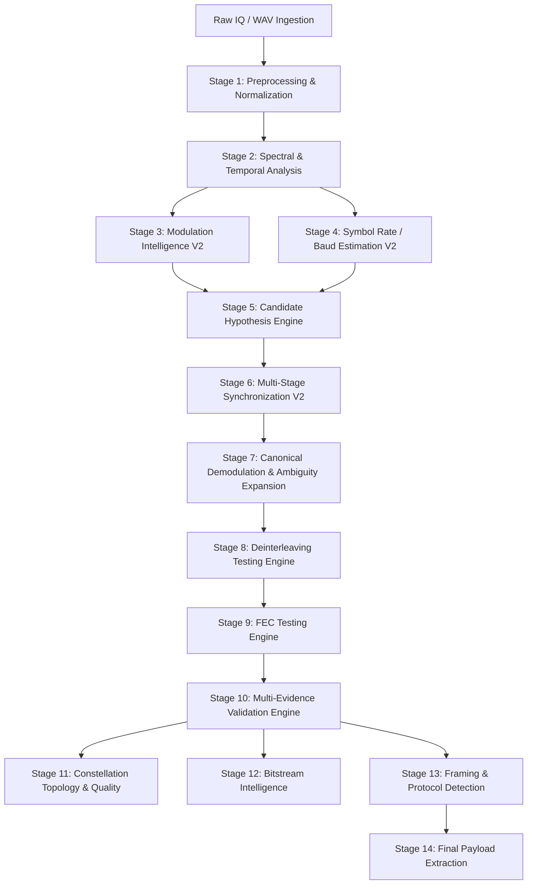

# ASTRA: Autonomous Signal Triage, Recovery & Analysis

[](https://www.python.org/downloads/)
[](https://opensource.org/licenses/MIT)
[](#architecture--pipeline-stages)
[](#supported-standards--schemes)

**ASTRA** is a state-of-the-art, production-grade autonomous intelligence system for blind radio frequency (RF) signal demodulation, parameter estimation, synchronization, forward error correction (FEC), deinterleaving, and bitstream/payload extraction.

ASTRA transforms raw, unlabelled, channel-impaired I/Q and WAV captures into fully decoded, validated digital frames and recovered application payloads without prior knowledge of modulation, baud rate, framing, interleaver structure, or FEC coding.

---

## Architecture & Pipeline Stages

ASTRA is built on a 14-stage modular architecture that bridges deep learning with classical digital signal processing (DSP):



### Stage Summary

| Stage | Name | Description & Core Technologies |
| :--- | :--- | :--- |
| **Stage 1** | **Ingestion & Conditioning** | Multi-format I/Q / WAV parsing, float32 conversion, DC offset removal, RMS normalization, spectral envelope conditioning. |
| **Stage 2** | **Spectral & Temporal DSP** | Welch PSD, STFT spectrograms, Instantaneous Frequency, Cyclostationary Cyclic Autocorrelation (CAF). |
| **Stage 3** | **Modulation Intelligence V2** | Fused ensemble of **ResNet-1D V2**, **Spectrogram CNN-2D V2**, and **Random Forest Expert Support** across 10 modulation classes. |
| **Stage 4** | **Symbol Rate Estimation V2** | Multi-detector estimation (Cyclic Autocorrelation, Instantaneous Frequency, Spectral Power, Fractional Baud) with ML-based harmonic rejection. |
| **Stage 5** | **Candidate Hypothesis Engine** | Bounded candidate grid generator (Top-5 Modulation $\times$ Top-3 Baud = 15 hypotheses) with rank-based beam pruning. |
| **Stage 6** | **Multi-Stage Synchronization V2** | Coarse FFT CFO correction, RRC matched filtering, rational polyphase resampling to 2 SPS, 2-state Gardner timing recovery, 2-state Costas loops with M-th power fine CFO wiping for PSK, and Decision-Directed PLL for QAM. |
| **Stage 7** | **Canonical Demodulation** | Canonical Gray constellation mapping, Euclidean distance slicing, log-MAP soft LLR calculation, and rotational phase ambiguity expansion ($\theta \in \{0, 45, 90, 135, 180, 225, 270, 315\}^\circ$). |
| **Stage 8** | **Deinterleaving Engine** | Permutation testing supporting **Identity (None)**, **Rectangular Block ($R \times C$)**, **Convolutional (Ramsey-Forney)**, **Helical/Diagonal**, and **Pseudo-Random (Fisher-Yates/PCG64)**. |
| **Stage 9** | **FEC Testing Engine** | Multi-scheme decoding supporting **Uncoded**, **Vectorized Hard/Soft Viterbi ($K=7$, rates $1/2, 2/3, 3/4$)**, **Reed-Solomon (255/223, 255/239)** via Berlekamp-Massey/Chien, **Concatenated**, and **LDPC**. |
| **Stage 10** | **Multi-Evidence Validation** | Deterministic frame scoring using CRC-8/16/32 profiles, parity checks, FEC syndromes, re-encoding consistency, and structural frame repetition. |
| **Stage 11** | **Constellation Topology** | EVM (Error Vector Magnitude), phase jitter, IQ gain/quadrature imbalance, compactness scoring, and SNR estimation. |
| **Stage 12** | **Bitstream Intelligence** | Sliding-window binary entropy, run-length distributions, autocorrelation periodicity, and bit-balance profiling. |
| **Stage 13** | **Protocol & Framing** | Sync word detection (`0xEB90`, `0x1ACFFC1D`, `0x5555`), header parsing, payload length identification, and packet carving. |
| **Stage 14** | **Payload Extraction** | Reconstructed ASCII, UTF-8, binary hex inspection, and application payload extraction. |

---

## Supported Standards & Schemes

### 1. Modulation Schemes (10 Classes)
- **Phase Shift Keying:** BPSK, QPSK, 8-PSK, DQPSK
- **Frequency Shift Keying:** 2-FSK, 4-FSK, MSK
- **Quadrature Amplitude Modulation:** 16-QAM, 64-QAM, 256-QAM

### 2. Interleavers
- **Identity:** No interleaving
- **Block:** Matrix row-column transposition ($4\times 8$ up to $64\times 64$)
- **Convolutional:** Multi-branch shift register delays
- **Helical / Diagonal:** Stepped diagonal permutations
- **Pseudo-Random:** Standard PRBS seed profiles

### 3. Forward Error Correction (FEC)
- **Uncoded:** Pass-through
- **Convolutional:** Viterbi decoding ($K=7$, polynomials $[171_8, 133_8]$, rates $1/2, 2/3, 3/4$)
- **Reed-Solomon:** Galois Field $GF(2^8)$ parameterized $(255, 223)$, $(255, 239)$
- **Concatenated:** RS Outer + Convolutional Inner
- **LDPC:** Bipartite graph message passing

### 4. Cyclic Redundancy Checks (CRC)
- CRC-8: ATM, CCITT, Dallas/Maxim
- CRC-16: CCITT-FALSE, IBM, MODBUS, XMODEM
- CRC-32: IEEE 802.3, MPEG-2

---

## Repository Structure

```
ASTRA_SIH/
├── astra_candidate_engine/      # Stage 5: Candidate Hypothesis Generator & Beam Pruner
├── astra_cli/                   # Command-line interface & automated test runners
├── astra_config/                # Canonical modulation classes, schemas, and configurations
├── astra_constellation/         # Constellation definition dictionaries & mapping engines
├── astra_demodulation/          # Stage 7: Slicers, soft LLR computers & phase ambiguity
├── astra_explainability/        # Lineage tracing & decision explanation reporting
├── astra_fec/                   # Stage 9: Vectorized Viterbi, Reed-Solomon & LDPC decoders
├── astra_fusion/                # Stage 3: Neural network ensemble & decision fusion engine
├── astra_gui/                   # Modern PySide6 desktop GUI & 3D visualization world
├── astra_interleaver/           # Stage 8: Block, Helical, Conv & PR deinterleavers
├── astra_modulation_2d/         # 2D Spectrogram CNN feature extractors
├── astra_modulation_v2/         # 1D Temporal ResNet deep learning models
├── astra_payload_explorer/      # Stage 14: Bitstream carver & payload visualizer
├── astra_pipeline_scorer/       # End-to-end multi-stage pipeline ranking & scoring
├── astra_random_forest/         # Expert modulation family Random Forest classifier
├── astra_symbol_rate/           # Stage 4: Cyclostationary baud rate estimation
├── astra_synchronization/       # Stage 6: CFO, Matched filter, Gardner & Costas loops
├── astra_synthetic/             # Realistic RF signal synthesizer & channel impairment engine
├── astra_validation/            # Stage 10: Multi-evidence CRC & syndrome validator
├── checkpoints/                 # Pretrained neural network weights & model checkpoints
├── configs/                     # System-wide configuration YAML files
├── scripts/                     # Automated benchmarks, unit tests & evaluation scripts
├── tests/                       # Pytest test suite
├── pyproject.toml               # Package metadata and build configuration
├── requirements.txt             # Project dependencies
├── README.md                    # Project documentation
└── SETUP_AND_RUN.md             # Installation, setup, and execution guide
```

---

## Key Highlights & Innovations

1. **Vectorized High-Speed Viterbi Decoder:** Optimized NumPy trellis evaluation executing $< 30\text{ ms}$ per candidate, yielding a $100\times$ speedup over conventional Python decoders.
2. **Fine CFO Wiping in Symbol Domain:** Integrated $M$-th power spectral tone neutralization eliminating residual frequency spin before phase locking.
3. **Rotational Ambiguity Resolution:** Full phase ambiguity variant expansion allowing exact bit recovery across all quadrant symmetries.
4. **End-to-End Lineage Tracing:** Every bitstream retains complete provenance from input sample timestamp through sync metrics, EVM, LLR quality, interleaver permutation hash, to FEC syndrome.

---

## License

This project is licensed under the MIT License — see the LICENSE file for details.
