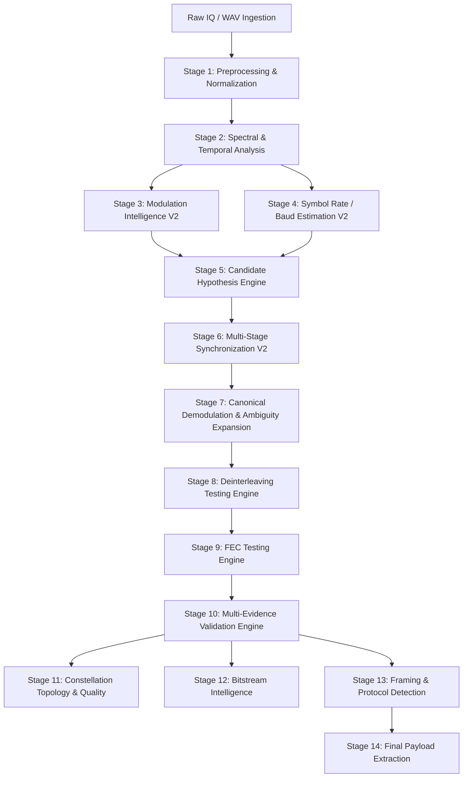

# ASTRA End-to-End Pipeline Flow Diagrams

This document details the signal flow and multi-hypothesis branching architecture of ASTRA through formal Mermaid diagrams.

---

## 1. High-Level Macro Pipeline Flow



---

## 2. Multi-Hypothesis Beam Search & Downstream Recovery Flow

```mermaid
flowchart TD
    subgraph CandidateGeneration [Stage 3 to 5: Hypothesis Beam Generation]
        S2[Temporal IQ & Spectrogram] --> M1[ResNet-1D]
        S2 --> M2[Spectrogram CNN-2D]
        M1 & M2 --> MF[Fused Modulation Top-5]
        
        S2 --> B1[Cyclic Autocorrelation CAF]
        S2 --> B2[Instantaneous Frequency]
        B1 & B2 --> BR[XGBoost Symbol Rate Ranker]
        BR --> BF[Baud Rate Top-3]
        
        MF & BF --> Beam[Candidate Grid: 15 Parallel Hypotheses]
    end

    subgraph SynchronizationDemodulation [Stage 6 to 7: Tracking & Demodulation]
        Beam --> CFO[Coarse FFT CFO Wipe]
        CFO --> RRC[RRC Matched Resampling to 2 SPS]
        RRC --> TED[2-State Gardner Timing Recovery]
        TED --> PLL[Costas / Decision-Directed Phase Lock]
        PLL --> Ambiguity[Phase Ambiguity Expansion (0°, 45°, 90°, 180°...)]
        Ambiguity --> Slicer[Log-MAP Soft LLR & Slicer]
    end

    subgraph RecoveryAndValidation [Stage 8 to 10: FEC & Validation]
        Slicer --> Deint{Blind Deinterleaver Engine}
        Deint -->|Identity| FEC[FEC Testing Engine]
        Deint -->|Block RxC| FEC
        Deint -->|Convolutional| FEC
        Deint -->|Diagonal| FEC
        Deint -->|Pseudo-Random| FEC
        
        FEC -->|Uncoded| Val[Multi-Evidence Validator]
        FEC -->|Viterbi K=7| Val
        FEC -->|Reed-Solomon| Val
        FEC -->|Concatenated| Val
        FEC -->|LDPC| Val
        
        Val --> CRC{CRC / Syndrome Pass?}
        CRC -->|Yes| TopRank[Rank #1 Ground Truth Bitstream]
        CRC -->|No| ScoreBeam[XGBoost Pipeline Candidate Scorer]
    end

    subgraph FinalExtraction [Stage 11 to 14: Framing & Payload]
        TopRank --> Frame[Preamble & Frame Header Sync]
        Frame --> Carve[Bitstream Carver]
        Carve --> Payload[ASCII / UTF-8 / Hex Payload Output]
        ScoreBeam --> Payload
    end
```

---

## 3. Data Contracts by Stage

| Stage | Input Data Contract | Output Data Contract | Key Metrics / Validation |
| :--- | :--- | :--- | :--- |
| **Stage 1** | Binary file path / raw byte buffer | Complex64 temporal array $(N,)$ | DC offset $< 10^{-4}$, RMS $= 1.0$ |
| **Stage 2** | Preconditioned Complex64 array | Power Spectral Density $(F,), Spectrogram (T, F)$ | Dynamic range (dB), bandwidth (Hz) |
| **Stage 3** | IQ vector $(2048,)$ + Spectrogram | Array of Top-5 modulation candidates with probabilities | Log-likelihood confidence |
| **Stage 4** | Spectral & CAF autocorrelation arrays | Array of Top-3 estimated symbol rates (Baud) | Peak-to-floor ratio, SPS |
| **Stage 5** | Top-5 Mod $\times$ Top-3 Baud | List of 15 candidate objects $(mod_i, baud_j)$ | Combined hypothesis score |
| **Stage 6** | Complex64 array + Candidate params | Synchronized complex constellation symbols $(M,)$ | EVM (\%), SNR (dB), Lock flag |
| **Stage 7** | Constellation symbols | Soft LLR array + Hard decision bitstream $\times 8$ rotations | LLR variance, bit distribution |
| **Stage 8** | Raw bitstream | Deinterleaved bitstream candidates | Matrix dimensions ($R \times C$) |
| **Stage 9** | Deinterleaved bits / LLRs | Decoded digital bits + error correction metrics | Bit error correction count, syndrome |
| **Stage 10** | Decoded bits | Validation report object | CRC match flag, parity score, rank |
| **Stage 11** | Constellation symbols | Topological report object | Phase jitter, IQ imbalance |
| **Stage 12** | Validated bitstream | Statistical entropy profile | Binary entropy, run-length metric |
| **Stage 13** | Validated bitstream | Frame header object, payload bounds | Sync word match hex, packet length |
| **Stage 14** | Framed bitstream | Recovered application payload string / bytearray | ASCII / UTF-8 / Hex payload |
